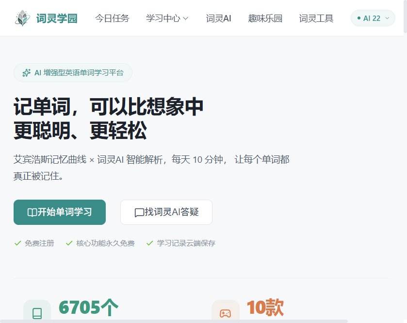
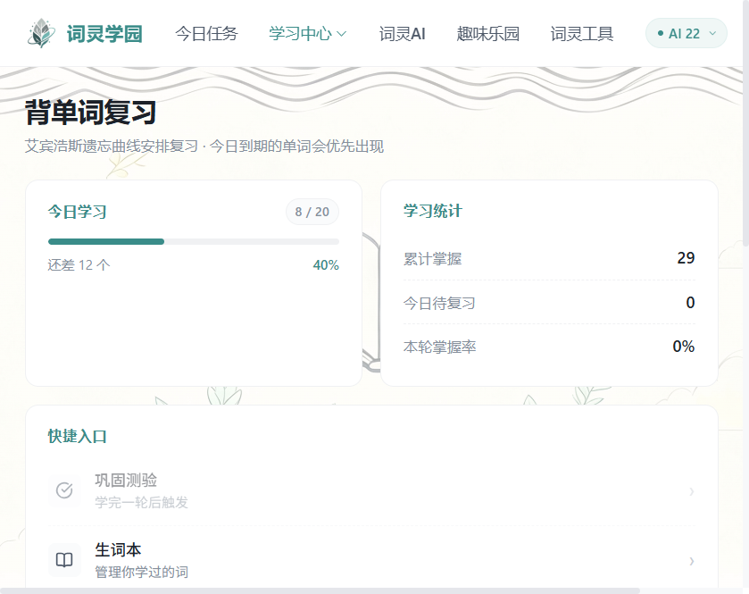
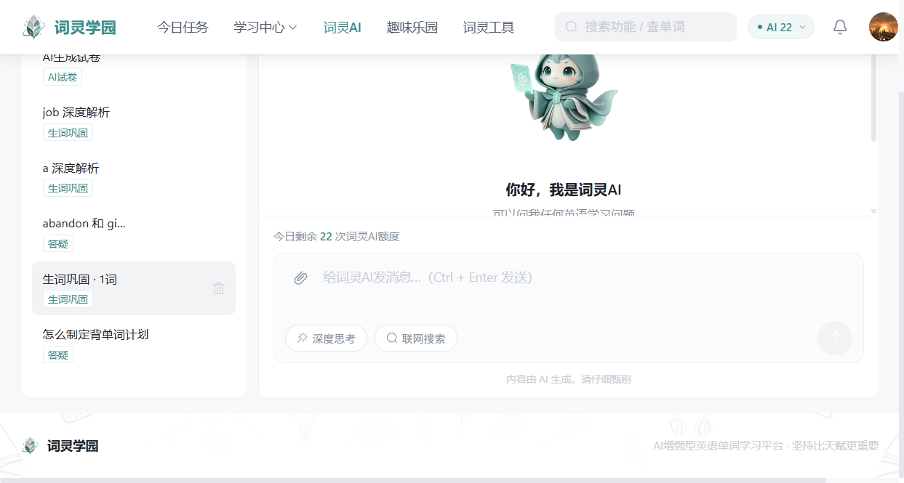
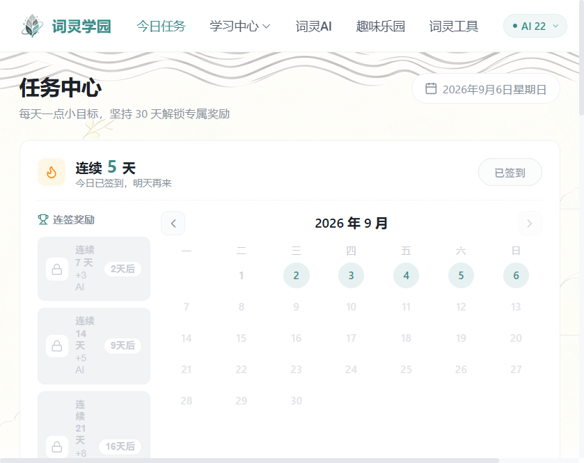
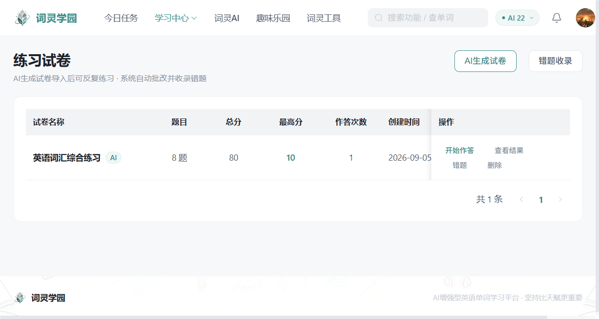
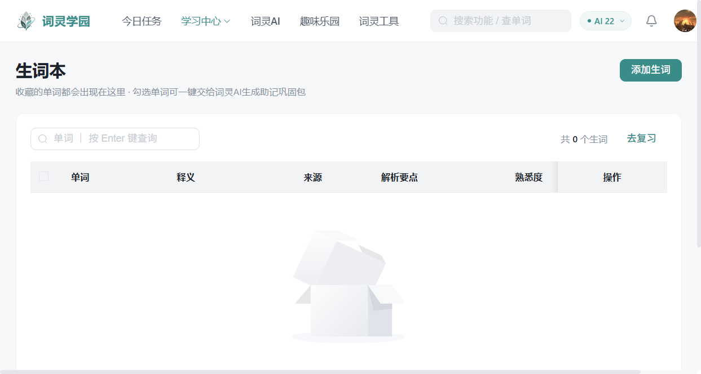
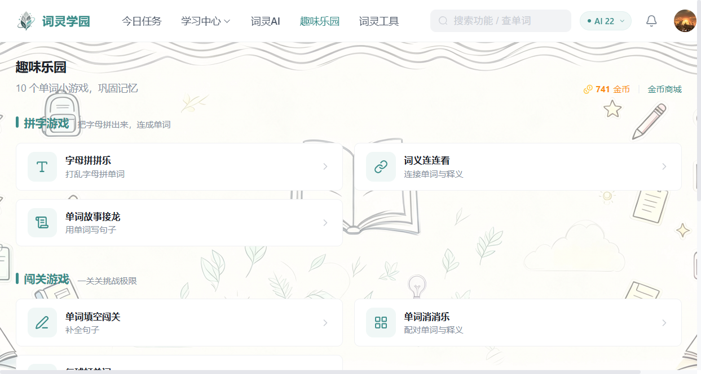
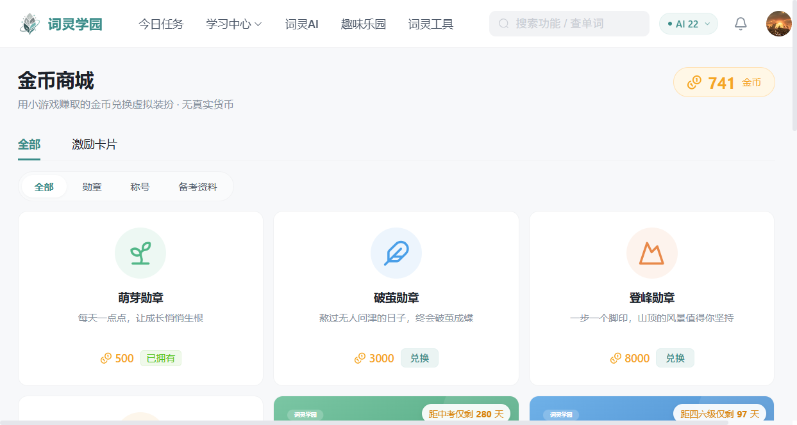
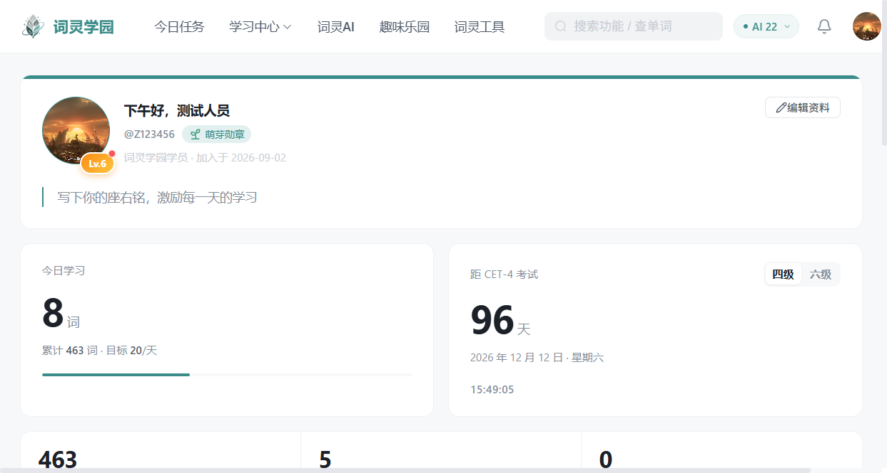

# 词灵学园 Ciling-Academy

   

一个英语单词学习平台。复习计划按艾宾浩斯遗忘曲线排，单词看不懂可以让词灵AI 拆解长难句、
讲阅读、做翻译，背完还能做试卷、玩单词小游戏检验效果。

说一下 AI 的定位：大模型只负责生成内容，复习调度、批改、计分这些核心逻辑全部是程序自己
实现的。所以不配置 AI Key 也能正常用，只是少几个 AI 功能，不会整个系统瘫掉。

## 项目预览

| | |
| --- | --- |
|  |  |
| 首页 | 背单词复习 |
|  |  |
| 词灵AI 答疑 | 任务中心 |
|  |  |
| AI 试卷 | 生词本 |
|  |  |
| 趣味乐园 | 金币商城 |
|  | |
| 个人中心 | |

## 功能

背单词部分：

- 生词学习、艾宾浩斯复习，到期单词优先推送，逾期越久排得越靠前
- 生词本，熟悉度四级流转，答错降级并重置复习计数
- AI 试卷（多种题型自动批改）+ 错题本，错题支持分页和批量移除
- 学习报告，今日已学、待复习、连续天数

词灵AI 部分：

- 长难句分析助手、阅读助手、翻译助手、自由答疑
- 返回的内容渲染成卡片，可以一键收藏成笔记
- 有额度管控、全局缓存和 RAG 知识增强，同一个问题不会重复烧 Key

其他：

- 10 款单词小游戏，有金币、星星和排行榜，词池做了跨游戏去重
- 金币商城，能兑换勋章、称号、词库包和备考资料（资料 PDF 是后端动态生成的）
- 等级、成就、连续签到、活跃度任务这些常规激励
- 个人中心、今日任务、工具盒、用户协议/隐私政策等静态页

## 技术栈

- 后端：Spring Boot 3.4、MySQL 8、Redis、MyBatis-Plus，密码加密用了 spring-security-crypto 的 BCrypt
- 前端：Vue 3.5、Element Plus（子路径按需引入）、Vite 5、Pinia、SCSS
- AI：通义千问（阿里云百炼的 OpenAI 兼容接口），RAG 检索用的 Qdrant

## 快速开始

环境：JDK 17+、Maven 3.8+、Node 18+，本地装好 MySQL 8 和 Redis。想用 AI 功能的话
去阿里云百炼申请个 API Key，`qwen-flash` 有免费额度，不申请也不影响其他功能。

1. 建库，执行两个 SQL：

```bash
mysql -uroot -p < backend/src/main/resources/db/schema.sql
mysql -uroot -p < backend/src/main/resources/db/data.sql
```

2. 配置私密信息。仓库里不放明文密钥，先把示例复制一份：

```bash
cd backend/src/main/resources
copy application-local.yml.example application-local.yml   # Windows
# cp application-local.yml.example application-local.yml   # macOS / Linux
```

然后打开 `application-local.yml`，至少把 MySQL 密码填上。这个文件在 .gitignore 里，
不会被提交。生产环境也可以不用这个文件，直接注入同名环境变量，变量名清单写在
[application.yml](backend/src/main/resources/application.yml) 的注释里。

3. 起后端，默认 8080：

```bash
cd backend
mvn spring-boot:run
```

4. 起前端：

```bash
cd frontend
npm install
npm run dev
```

访问 http://localhost:5173，接口自动代理到 8080，不用处理跨域。

## 目录结构

```
ciling-academy/
├─ backend/                          # 后端，细节见 backend/README.md
│  ├─ src/main/java/com/wordspirit/
│  │  ├─ ai/                         # AI 基础设施：额度、限流、缓存、RAG
│  │  ├─ common/                     # 统一返回、全局异常、分页
│  │  ├─ config/                     # Web、CORS、密码加密、OSS
│  │  └─ module/                     # 业务模块，共 16 个
│  └─ src/main/resources/
│     ├─ application.yml             # 敏感项全是 ${ENV:} 占位符
│     └─ db/schema.sql               # 建表脚本
├─ frontend/                         # 前端，细节见 frontend/README.md
│  ├─ src/
│  ├─ public/frames/                 # 词灵序列帧动画（WebP）
│  └─ vite.config.js
├─ docs/                             # 架构描述、调用时序、设计稿
└─ deploy/                           # 部署辅助脚本
```

## 安全上做了什么

- 密码用 BCrypt 加盐哈希存储，数据库被拖了也拿不到明文，存量密码格式兼容无需迁移
- 登录防爆破：同一个用户名连续错 5 次，锁 15 分钟（Redis 计数）
- 登录失败提示统一是"用户名或密码错误"，不暴露账号是否存在
- CORS 是白名单制，默认只放行本机 5173，生产环境用 `APP_CORS_ORIGINS` 配自己的域名
- 会话 Token 是服务端生成的随机 UUID 存 Redis，7 天滑动过期，可以随时踢下线
- 验证码有图形码和邮箱码两层，发邮件有 60 秒间隔和每日上限
- SQL 全部走 MyBatis-Plus 参数化，没有字符串拼接
- 错题删除这类接口在服务端校验数据归属，改 ID 越权拿不到别人的数据
- 异常统一由全局处理器返回友好文案，堆栈不会漏到前端

生产部署记得上 HTTPS，这一层应用代码替代不了。

## 性能与流量

前端做过一轮比较彻底的优化：Element Plus 改成子路径按需引入（用官方 resolver 会因为
主入口的副作用导入导致 tree-shaking 失效，整包 960KB 全进产物），路由全部懒加载，
框架依赖拆成 vue-vendor 长缓存。词灵的序列帧动画从 PNG 重编码成 WebP，体积从 76.4MB
降到 4.1MB。细节写在 [frontend/README.md](frontend/README.md)。

后端这边：API 响应开了 gzip（JSON 压缩率大概 70%~85%），Redis 配了 Lettuce 连接池，
AI 调用做了全局缓存，同一个输入只调一次大模型。

## 相关文档

- [后端架构描述](docs/后端架构描述.md)
- [后端调用流程与时序](docs/AI调用流程与时序.md)
- [前端工程说明](frontend/README.md)
- [后端工程说明](backend/README.md)

## 许可

仅供学习交流使用。
